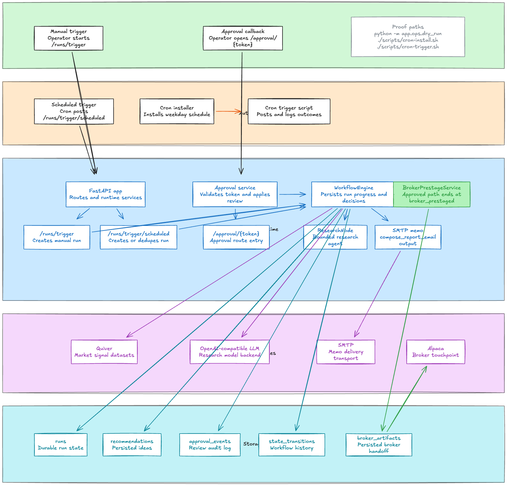
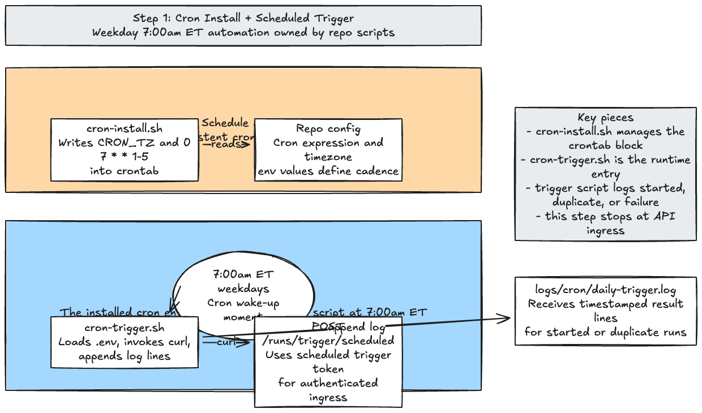
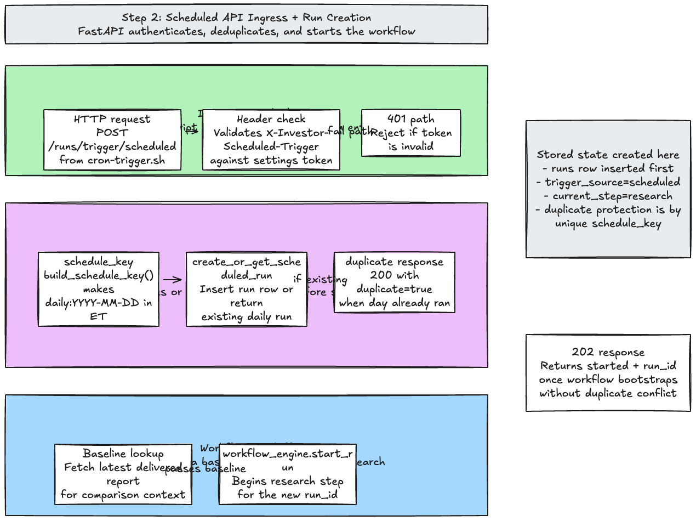
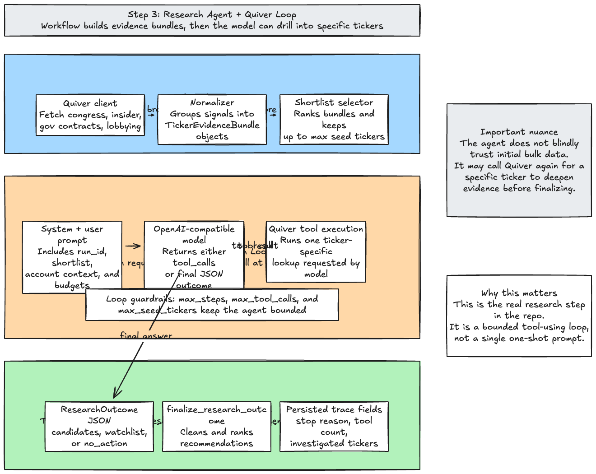
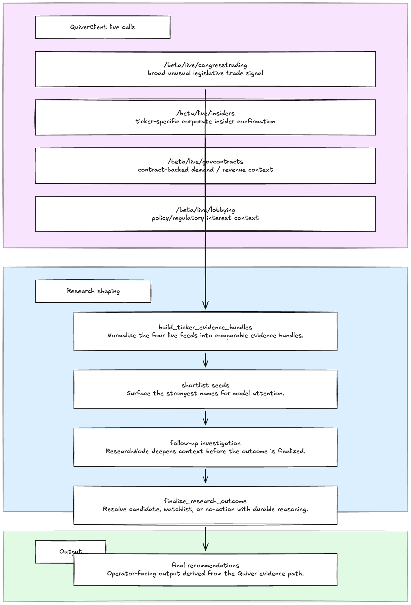
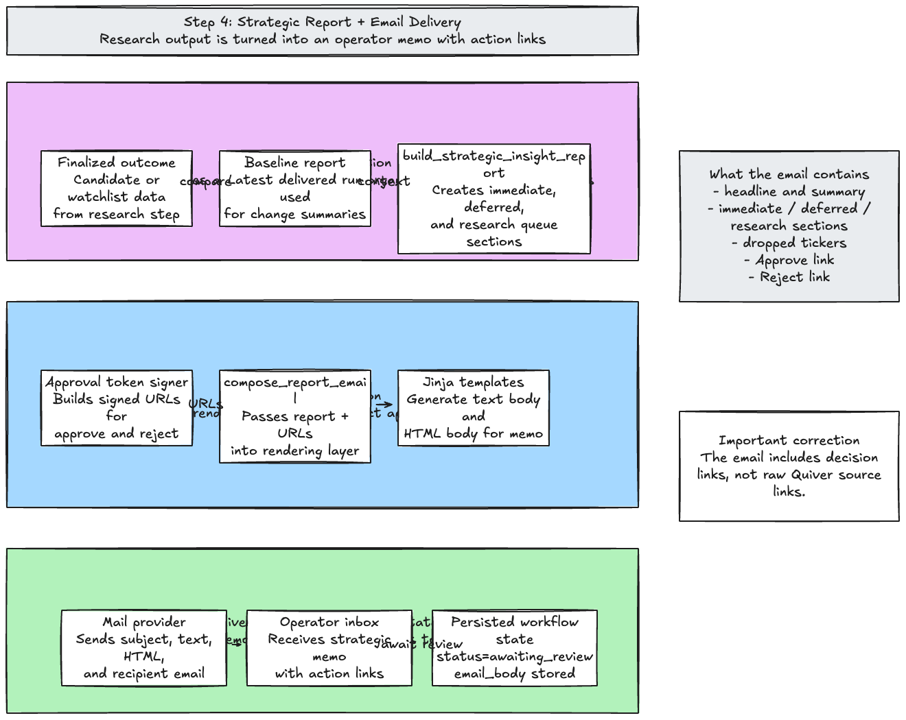
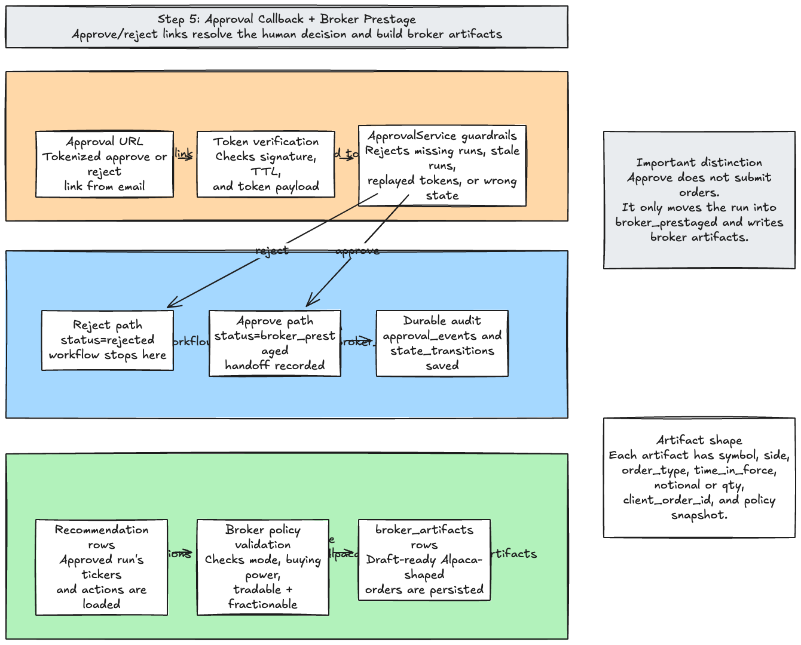
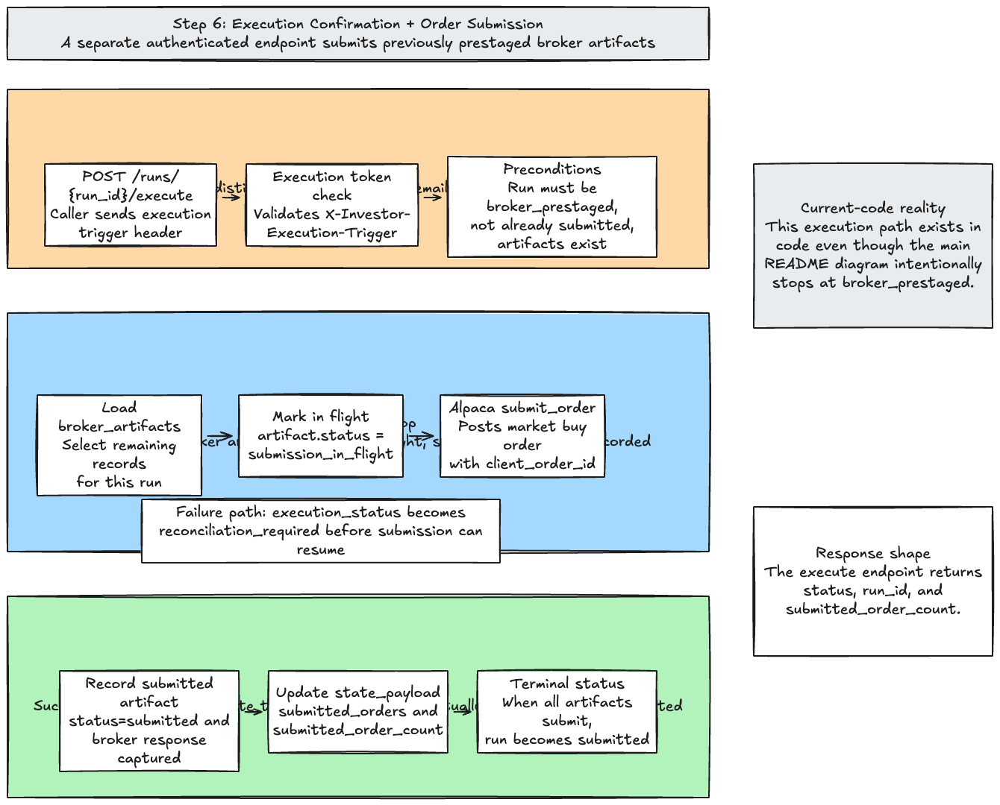

# investor

Local-first Python service for an app-owned investing workflow.

## Why This Project Exists

This project exists to keep an investing workflow owned by the app instead of hidden inside manual operator steps, spreadsheets, or third-party automation glue. The goal is to make the loop inspectable, restart-safe, and operationally simple: research happens in one place, decisions are reviewed through an explicit approval step, and broker handoff artifacts are stored so the current state is always visible.

## What This Project Does

The service runs a structured investing loop from trigger to broker prestage. A manual or scheduled trigger starts a run, the workflow gathers Quiver evidence, uses the configured OpenAI-compatible model to produce research and a recommendation, renders and sends the operator memo, waits for approval through the callback link, and then persists the broker-ready artifacts. In the current implementation, the app is focused on getting reliably to `broker_prestaged` rather than silently placing live orders.

## System Architecture



The diagram shows the live operator and automation paths: manual and scheduled triggers enter the FastAPI app, the workflow gathers Quiver evidence, uses the OpenAI-compatible research model, delivers the SMTP memo, and resumes through the approval link. Durable records for runs, recommendations, approval events, state transitions, and broker artifacts stay visible because restart safety is part of the implemented contract.

The current approved path ends at `broker_prestaged`, where broker artifacts are persisted and ready for broker review. The README and diagram intentionally stop there rather than presenting direct order submission as the current architecture. Use `python -m app.ops.dry_run` as the fastest proof path that the trigger, memo, approval, and broker-prestage flow still line up.

## Detailed Flow Diagrams

These step-level diagrams break the runtime into separate, readable stages. Each screenshot has a matching editable `.excalidraw` source in `docs/architecture/flow-steps/`.

### 1. Cron Install + Scheduled Trigger

Editable source: `docs/architecture/flow-steps/01-cron-scheduled-trigger.excalidraw`



### 2. Scheduled API Ingress + Run Creation

Editable source: `docs/architecture/flow-steps/02-scheduled-api-ingress.excalidraw`



### 3. Research Agent + Quiver Loop

Editable source: `docs/architecture/flow-steps/03-research-agent-quiver-loop.excalidraw`



## Quiver Research Flow



The live Quiver research loop makes four distinct calls before the model decides what deserves follow-up investigation. `/beta/live/congresstrading` supplies the broad unusual legislative trade signal, `/beta/live/insiders` adds ticker-specific corporate insider confirmation, `/beta/live/govcontracts` adds contract-backed demand / revenue context, and `/beta/live/lobbying` adds policy/regulatory interest context. Those feeds become evidence bundles, shortlist seeds, follow-up investigation, and final recommendations rather than one undifferentiated Quiver blob.

### 4. Strategic Report + Email Delivery

Editable source: `docs/architecture/flow-steps/04-report-email-delivery.excalidraw`



### 5. Approval Callback + Broker Prestage

Editable source: `docs/architecture/flow-steps/05-approval-broker-prestage.excalidraw`



### 6. Execution Confirmation + Order Submission

Editable source: `docs/architecture/flow-steps/06-execution-order-submission.excalidraw`



## Setup

```bash
cp .env.example .env
docker compose up -d --build
```

Normal runtime composition now depends on the configured Quiver and OpenAI-compatible credentials rather than the old stubbed defaults. The app container owns the scheduler process; the app container owns the weekday scheduler process through the repo-managed scripts in `ops/scheduler/`.

## Dry Run

```bash
python -m app.ops.dry_run
```

Use `python -m app.ops.dry_run` as the canonical no-hidden-manual-work proof path. It runs scheduled trigger, memo generation, approval callback, and broker prestage locally by injecting deterministic doubles instead of the normal live adapters.
Watchlist and no-action items now explain why the idea is not actionable, what evidence is missing, which questions remain unresolved, and what to check on the next session.

## Docker Operations

```bash
docker compose logs -f migrate app
```

Use the combined `migrate` and `app` logs as the primary scheduler observability path. The scheduler bootstrap prints the rendered crontab to stdout, and the scheduled-trigger wrapper emits the exact `scheduled_trigger result=...` lines into the `app` container logs.

```bash
docker compose down -v
```

Keep `INVESTOR_SCHEDULE_CRON_EXPRESSION=0 7 * * 1-5` and `INVESTOR_SCHEDULE_TIMEZONE=America/New_York` aligned unless you intentionally want a different cadence.

## Go-Live Checklist

- SMTP credentials send to the real operator inbox
- Quiver API key and base URL point to the intended account
- OpenAI-compatible API key, base URL, and model are configured for ResearchNode
- INVESTOR_EXTERNAL_BASE_URL resolves to the public approval host
- Alpaca paper mode uses https://paper-api.alpaca.markets
- INVESTOR_SCHEDULE_TIMEZONE is set to America/New_York for the managed 7:00am ET scheduler
- docker compose up -d --build starts postgres, migrate, and app successfully
- docker compose logs -f migrate app shows the rendered crontab and scheduled trigger output
- See `.planning/phases/15-prove-the-live-quiver-to-email-workflow-end-to-end/15-LIVE-PROOF-RUNBOOK.md` for the real-credential live proof workflow.
- The live-proof commands are `python -m app.ops.live_proof preflight`, `python -m app.ops.live_proof trigger-scheduled`, and `python -m app.ops.live_proof inspect-run --run-id <run_id>`.

## Acceptance Check

```bash
docker compose up -d --build
docker compose logs -f migrate app
docker compose down -v
```
